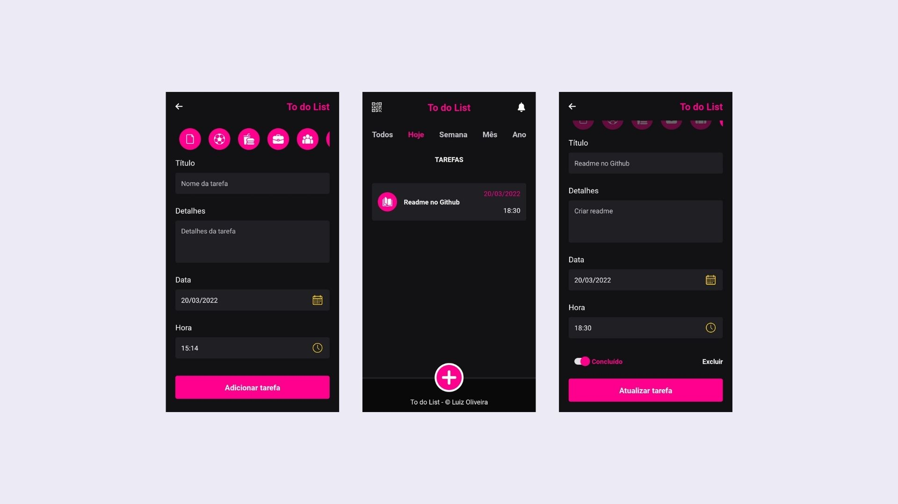

### To do List

Trata-se de um aplicativo que lista todas as tarefas cadastradas pelo usuário em determinada data. Para tal feito, usei o MongoDB como banco de dados, NodeJS para o desenvolvimento da API e React Native para o desenvolvimento do aplicativo

### Funcionalidades
- Permite o usuário adicionar, atualizar e excluir tarefas
- Permite o usuário filtrar tarefas por dia, mês e ano
- Permite o usuário ver tarefas atrasadas

### Tecnologias
- NodeJS
- Express
- MongoDB
- React Native
- React Navigation
